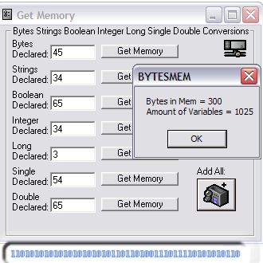



## Determine Mem of Var in Prog

### Description

Another thing i made because i was bored. It came as a use to me probably not anyone else. I have an obbession with how much my program uses. So i made this program to determine the amount of room my data types took up.
 
### More Info
 
Yes, so that how much memory it took. ;)

             |
---                |---
**Submitted On**   |2002-02-23 17:18:30
**By**             |[Josh Nixon](https://github.com/Planet-Source-Code/PSCIndex/blob/master/ByAuthor/josh-nixon.md)
**Level**          |Beginner
**User Rating**    |3.8 (23 globes from 6 users)
**Compatibility**  |VB 3\.0, VB 4\.0 \(16\-bit\), VB 4\.0 \(32\-bit\), VB 5\.0, VB 6\.0
**Category**       |[Complete Applications](https://github.com/Planet-Source-Code/PSCIndex/blob/master/ByCategory/complete-applications__1-27.md)
**World**          |[Visual Basic](https://github.com/Planet-Source-Code/PSCIndex/blob/master/ByWorld/visual-basic.md)
**Archive File**   |[Determine\_571562232002\.zip](https://github.com/Planet-Source-Code/josh-nixon-determine-mem-of-var-in-prog__1-32071/archive/master.zip)

